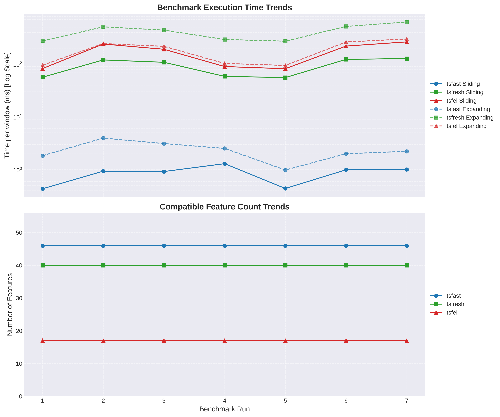

# TSFast: Ultra-Fast Time Series Feature Extraction

TSFast is a high-performance time-series feature extraction library written in Rust with Python bindings. It is designed for extreme speed, efficient memory usage, and interoperability with Apache Arrow.

## Key Features

- **Blazing Fast**: Core engine implemented in Rust with SIMD (Portable SIMD) for maximum performance.
- **O(n) Expanding Windows**: Highly optimized algorithms for expanding window feature extraction (prefix statistics).
- **Arrow Integration**: Uses Apache Arrow for efficient, zero-copy-ready data handling via `pyarrow`.
- **Selective Execution**: Only computes the features you request, using a bitmask-based engine to skip unnecessary calculations.
- **Python-Friendly**: Simple API based on `Extractor` and `ExpandingExtractor` classes.

## Benchmarks

## Latest Results
| Date                |   CommitHash | Benchmark_Name                       |   Metric_Value | Unit   |   Delta_From_Last | Direction   |
|:--------------------|-------------:|:-------------------------------------|---------------:|:-------|------------------:|:------------|
| 2026-10-03 18:23:38 |      7848612 | tsfast_sliding_first_window          |       9.4521   | ms     |              0.24 | ⚪          |
| 2026-10-03 18:23:38 |      7848612 | tsfast_sliding_avg_next_50           |       1.01063  | ms     |              1.73 | ⚪          |
| 2026-10-03 18:23:38 |      7848612 | tsfast_expanding_first_window        |       1.48129  | ms     |             79.57 | 🔴          |
| 2026-10-03 18:23:38 |      7848612 | tsfast_expanding_avg_next_50         |       2.22456  | ms     |             11.04 | 🔴          |
| 2026-10-03 18:23:38 |      7848612 | tsfast_static_sliding_first_window   |       1.0705   | ms     |              6.25 | 🔴          |
| 2026-10-03 18:23:38 |      7848612 | tsfast_static_sliding_avg_next_50    |       1.03675  | ms     |              7.15 | 🔴          |
| 2026-10-03 18:23:38 |      7848612 | tsfast_static_expanding_first_window |       0.994682 | ms     |              2.91 | ⚪          |
| 2026-10-03 18:23:38 |      7848612 | tsfast_static_expanding_avg_next_50  |       4.09384  | ms     |              4.57 | ⚪          |
| 2026-10-03 18:23:38 |      7848612 | tsfresh_sliding_first_window         |     144.383    | ms     |              7.1  | 🔴          |
| 2026-10-03 18:23:38 |      7848612 | tsfresh_sliding_avg_next_50          |     127.196    | ms     |              3.81 | ⚪          |
| 2026-10-03 18:23:38 |      7848612 | tsfresh_expanding_first_window       |     127.572    | ms     |              6.09 | 🔴          |
| 2026-10-03 18:23:38 |      7848612 | tsfresh_expanding_avg_next_50        |     625.078    | ms     |             21.04 | 🔴          |
| 2026-10-03 18:23:38 |      7848612 | tsfel_sliding_first_window           |     251.215    | ms     |              6.75 | 🔴          |
| 2026-10-03 18:23:38 |      7848612 | tsfel_sliding_avg_next_50            |     262.99     | ms     |             20.1  | 🔴          |
| 2026-10-03 18:23:38 |      7848612 | tsfel_expanding_first_window         |     366.015    | ms     |             68.62 | 🔴          |
| 2026-10-03 18:23:38 |      7848612 | tsfel_expanding_avg_next_50          |     298.517    | ms     |             13.98 | 🔴          |
| 2026-10-03 18:23:38 |      7848612 | tsfast_compatible_features           |      46        | count  |              0    | ⚪          |
| 2026-10-03 18:23:38 |      7848612 | tsfresh_compatible_features          |      40        | count  |              0    | ⚪          |
| 2026-10-03 18:23:38 |      7848612 | tsfel_compatible_features            |      17        | count  |              0    | ⚪          |
